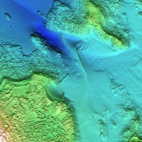

# litto3d-tools

The [SHOM](https://www.shom.fr/), French Navy hydrographic office, delivered Litto3D&reg;, a set of coastal bathymetric data files for several French mainland and overseas areas.
Those data files are delivered as open data as long as the source is quoted.

litto3d-tools provides a Python script to convert those bathymetric data files to charts as PNG images and a set of procedures to put together those PNG files to obtain larger charts.



## Download data from SHOM web site
SHOM web site provides data as a set of `.7z` files.
The name of those files have the following pattern `XXXX_YYYY.7z`, where `XXXX` is the longitude and `YYYY` the latitude in Lambert93 coordinates.

Download all the area data files you are interested in and place them in a folder.

## Unzip data files
Once `.7z` have been downloaded, those files have to be unzipped to a temporary directory in oreder to process them later.
Those files can be unzipped using `make`.

In `Makefile` a few variables can be configured:
| Variable | Description |
|---|---|
|ZIP_PATH|Location of `.7z` data files. Default value is `~/Downloads` as this the location where those files are downloaded when using Firefox|

```
make
```

## Convert asc files to png
To convert `.asc` into `.png` files, you can use the make target `png`.

In `Makefile` a few variables can be configured for this phase:
| Variable | Description |
|---|---|
|PNG_DIR|Location of `.png` files. Default value is `/var/tmp/litto3d/png/`|
|MIN_ELEVATION|This is the minimal elevation (altitude in meters) of the maps. This parameter is needed for altitude scale colors to be identical from `.png` file to an other|
|MAX_ELEVATION|This is the maximal elevation (altitude in meters) of the maps. This parameter is needed for altitude scale colors to be identical from `.png` file to an other|

```
make png
```

## ASC file format
`.asc` are ASCII files containning a few metadata and the array of elevation.

Metadata are:
* number of data collumns
* number of data rows
* longitude
* latitude
* mesh size

Metadata are followed by (numcols x numrows) elevation values in meter.

```
ncols 1000
nrows 1000
xllcenter 216000.000000
yllcenter 6876001.000000
cellsize 1.000000
nodata_value -99999.000000
-99999.00 -16.71 -16.71 -16.71 -16.71 -16.71 -99999.00 -99999.00 -17.11 [...]
-19.97 -19.80 -19.62 -19.43 -19.31 -19.21 -19.18 -19.10 -19.05 -18.43 -18.43 [...]
[...]
```

The exact specification can be found [here](https://services.data.shom.fr/static/specifications/DC_Litto3D.pdf).

For each area, the shom delivers the data as 1000 x 1000 1m mesh data or 200x200 5m mesh data.

## PNG
PNG image format has been choosed for 3 rationals:
* compressed.
* lossless which is important for charts.
* alpha capabilities allowing to display missing data.

## asc2png principle
`asc2png` is a Python script based on both:
* numpy library for its array manipulation capabilities.
* mathplotlib library for its data manipulation and visualization capabilities.

Convertion from `.asc` to `.png` files is made in 5 steps:
* import `.asc` file into pynum array containing altitudes of points.
* compute mesh shading from both sun direction and mesh orientation.
* compute colors from both altitude and a color map.
* combine colors and shading array to produce a colored shaded map with 3D visual "sensation".
* export this array to a PNG image file.

## asc2png usage
In order to convert a `.asc` file to a `.png` file, just type:
```
python3 asc2png.py inputfile.asc outputfile.png
```
